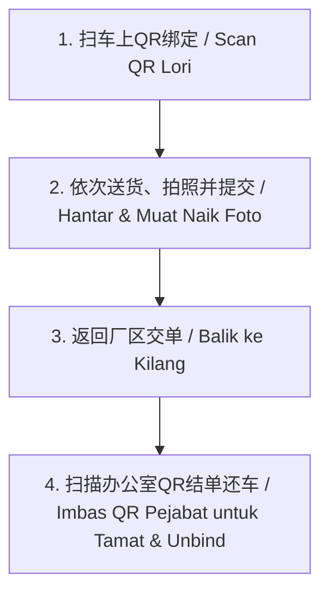

# PackSecure 司机配送与扫码还车 SOP (Standard Operating Procedure)
### Prosedur Operasi Standard Penghantaran & Pemulangan Lori

本文档旨在指导司机如何使用 PackSecure 手机系统进行卡车绑定、送货照相上传，以及回厂扫码交单结束行程。
*Dokumen ini bertujuan untuk membimbing pemandu menggunakan sistem telefon PackSecure bagi menambat lori, memuat naik foto penghantaran, dan mengimbas kod QR di pejabat untuk tamat trip.*

---

## 1. 流程简图 / Ringkasan Aliran Kerja

---

## 2. 详细步骤 / Langkah-Langkah Terperinci

### 步骤一：开工绑定卡车 / Langkah 1: Tambat Lori (Mula Syif)
1. **登录系统**：打开手机浏览器访问 PackSecure 系统并登录。
2. **进入绑定**：在主页点击 **「Ketik untuk Imbas QR Lori / 扫码绑定卡车」** 按钮。
3. **扫描卡车 QR**：将摄像头对准卡车控制台/仪表盘上的 **卡车 QR 码**。
   * *绑定成功*：顶部横幅显示卡车车牌（例如：`Lori Sekarang: PGD 1234`），代表车辆已成功锁定。

---

### 步骤二：送货与拍照上传 / Langkah 2: Hantar Barang & Muat Naik Foto (Dalam Perjalanan)
司机前往目的地送货，每送达一个 Drop Point (客户)，按照以下步骤操作：
1. **选择订单**：在 **Pending (Dalam Proses)** 列表中，找到并点开当前送达的客户订单。
2. **拍照上传凭证 (Proof of Delivery)**：
   * **BUNYIK DO (DO 照片)**：点击并拍摄已经由客户签字、盖章的 Delivery Order 纸质单据。
   * **BUKTI BARANG (货物照片)**：点击并拍摄货物在客户仓库/卸货点的现场照片。
3. **填写备注 (Catatan)**：（选填）如有少件、破损等异常情况，在此输入。
4. **提交此站 (Submit Drop)**：
   * 点击最下方绿色的 **「HANTAR DROP POINT INI / SUBMIT THIS DROP POINT」** 按钮。
   * 确认弹出框（*Are you sure you want to SUBMIT?*）选择**确定**。
   * *注意：送货途中没有任何“结束整趟行程/Tamat”的按钮，直接正常提交即可！*
5. **继续送下一站**：状态变更后，返回列表，前往下一个目的地。

---

### 步骤三：回厂交单与扫车上二维码收工 / Langkah 3: Balik Pejabat & Imbas QR Lori (Tamat Trip)
当今天的所有货物全部送完，并且回到了 **Taiping 厂区** 后：
1. **提交纸质单据**：前往办公室，将所有客户签字盖章的纸质 DO 单交回给文员。
2. **点击结束下班**：在手机主页顶部的蓝色卡车横幅中，点击 **「TAMAT SYIF / END SHIFT」** 按钮。
3. **扫描卡车二维码**：
   * 手机将开启扫码器（提示：*IMBAS QR LORI (PEMULANGAN) / SCAN LORRY QR (RETURN VEHICLE)*）。
   * 将摄像头再次对准您**当前驾驶的卡车仪表盘/控制台上的 QR 码**（即早上开工绑定的同一个二维码）。
4. **结算并解绑**：
   * 扫码成功后，系统会自动将您今天送完的所有订单变更为 **Selesai / Done (Delivered)**，并解除车辆绑定。
   * 界面提示：`✅ Syif Selesai & Lori dilepaskan!`，代表今天的工作结算完毕。

---

## 3. 注意事项 / Perkara Penting

> [!WARNING]
> * **切勿在路途上寻找 Tamat 按钮**：新版系统中，途中不再有手动结束行程的操作，送货完毕后**必须扫卡车码**方能结算下班。
> * **必须扫描同一辆车**：下班扫码时，必须扫描您今天所驾驶的卡车上贴的同一个 QR 码，扫描其他车辆将提示错误。
> * **照片清晰度**：拍摄 DO 单据时，请确保文字、签名、公章清晰可辨。如果照片模糊，后台文员有权在回厂审核时要求重拍。
