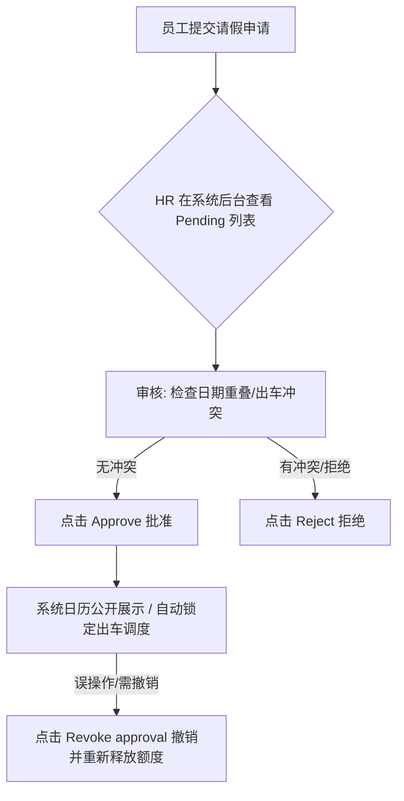

# PackSecure HR 假期审批标准操作规程 (Standard Operating Procedure for Leave Approval)

本文档旨在指导 HR（人力资源）及工厂管理人员（Admin / Manager）如何在系统后台正确审核、批准、拒绝和撤销员工（包括司机及操作工）的请假申请。

---

## 1. 假期申请审批流程概述

员工通过前端系统提交请假申请后，系统会自动在后台的 **Approvals** 板块生成待办审批。HR 必须按照以下步骤进行审核：

---

## 2. 详细操作步骤

### 第一步：进入审批界面
1. 登录拥有 `SuperAdmin` / `Admin` / `HR` / `Manager` 权限的账户。
2. 导航至 **Staff Hub (URUSAN STAF / STAFF HUB)**。
3. 点击 **Approvals** 选项卡（仅管理层角色可见，右侧带有红色气泡显示待审批的请假总数）。

### 第二步：审核请假详情
在 **Needs Your Review** 列表中，HR 需核对：
*   **申请人姓名与角色**（如 Driver 司机，还是 Operator 机器操作工）。
*   **请假日期区间与总天数**（如 `2026-06-15` 至 `2026-06-18`，共 4 天）。
*   **请假原因**（如果是病假或紧急私事，核实是否需要员工补交相关证明，如病假单 MC）。

> [!WARNING]
> **司机请假核对冲突**：
> 在批准**司机 (Driver)** 的假期前，HR 必须进行以下冲突核对：
> 1.  **运单冲突**：先进入 **Logistics / Delivery** 调度看板，核实该司机在请假期间是否已经有被分配的未完成配送单 (Trips)。如有分配好的配送单，须先将这些配送单重新指派给其他可用司机，**方可批准假期**。
> 2.  **人数冲突（多人同日请假）**：**如果同一天有超过一个司机（2位及以上）请假，系统会在审批界面显示黄色警告**。HR 需评估当天工厂出货量，原则上除极特殊情况（如病假/紧急事假），**不建议同时批准两位或以上司机在同一天请假**，以确保运输运力充足。

### 第三步：执行审批动作
*   **批准假期 (Approve)**：
    *   点击 **Approve** 按钮。
    *   **系统联动效果**：
        1. 假期的状态更新为 `Approved`。
        2. 全员共享的 **Calendar View (日历视图)** 会自动显示该员工的请假范围（仅显示姓名和日期，不公开具体原因，保护隐私）。
        3. 该员工在请假天数内的薪资结算和出勤率，将自动与 **Personal Monthly Report (个人月度报表)** 关联，计入 Approved Leaves（已批准休假天数）。
*   **拒绝假期 (Reject)**：
    *   点击 **Reject** 按钮。
    *   **系统联动效果**：假期的状态更新为 `Rejected`，不计入日历，且员工可以重新选择其他日期提交。

---

## 3. 已批准假期的“撤销”规范 (Revoke Approval)

如果发现误批、员工临时取消请假、或者日期填错，HR 可以对已批准的假期执行**撤销 (Revoke)** 操作：

1. 滚动至 **Approvals** 页面的 **Approved leave — revoke** 列表。
2. 找到对应员工的批准记录，点击右侧红色的 **Revoke approval** 按钮。
3. 确认后，系统会将该请假记录的状态强行改为 `Rejected`。
4. **系统联动效果**：
   * 该假期会立即从公共 **Calendar View (日历)** 中移除。
   * 该员工将被重新标记为“可用”，可以重新分配车辆和 Trips 配送单，并且月度报表中的出勤天数会自动校正。

---

## 4. 薪酬与报表联动规范

HR 在每月月底进行工资核算时，应当核对 **Personal Monthly Report** 中的以下字段：
1.  **Cuti diluluskan / Approved leaves**：统计该员工本月所有的已批准假期。
2.  **无薪假扣除 (Unpaid Leave Deductions)**：
    *   若请假天数超出该员工本年度的带薪假配额，HR 须在 **Payroll** 系统中将超出天数登记为 `Unpaid Leave`。
    *   系统将在生成工资单时自动计算底薪扣减：`base_salary - (leave_days_unpaid * 日薪)`。

---

> [!IMPORTANT]
> **系统完整性提醒**：
> 严禁在数据库中手动删除 `employee_leave` 表的记录。所有的请假归档和撤销，均必须通过系统前端的 **Approve**、**Reject** 和 **Revoke** 按钮进行，以保证操作日志 (Audit Logs) 完整，便于日后查证。
