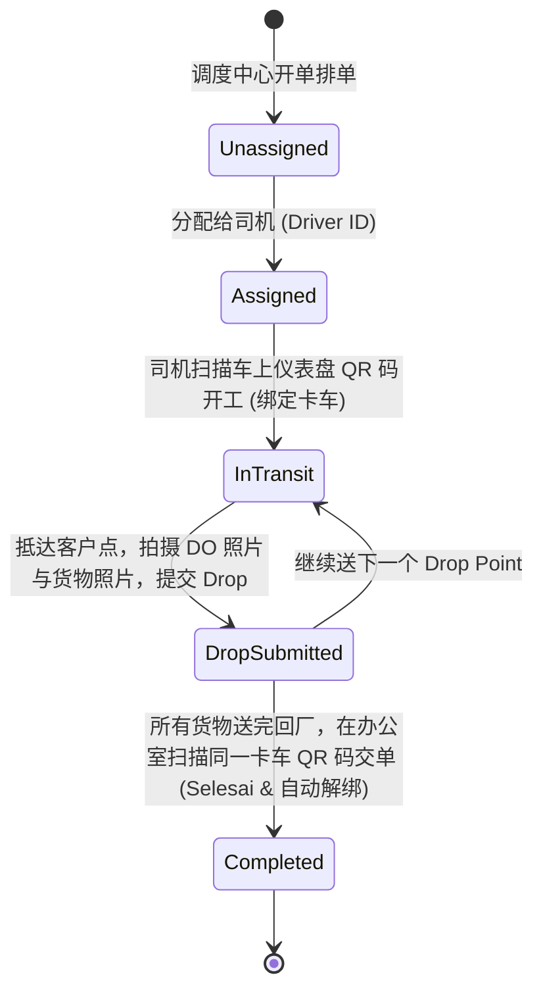

# Packsecure OS — 核心业务规则与真理字典 (Business Rules & Domain Knowledge)

本文档是 Packsecure OS 的**唯一业务真理来源 (Single Source of Truth)**。任何 Agent 或开发者在进行功能新增、重构或数据变更时，**必须严格遵循本文档所定义的规则，严禁在重构中遗漏任何既有逻辑**。

---

## 1. 厂区与仓库体系 (Factories & Warehouses)

| 厂区代码 / 标识 | 厂区名称 | 业务属性与定位 | 产线与产品限制规则 |
| :--- | :--- | :--- | :--- |
| **OPM Lama** (T1) | 太平旧厂 (Taiping Main) | 核心生产基地 & 仓库 | 气泡膜 (Bubble Wrap) 与 缠绕膜 (Stretch Film) 主力生产/存放地。 |
| **OPM Corner** / **OPM Baru** | 太平新厂 / 角落厂区 | 仓储与辅助加工 | 与 OPM Lama 紧密联动（OPM Corner 即 OPM Baru）。 |
| **OPM Ali** | 太平分厂 | 仓储/流转 | 辅助仓储点。 |
| **SPD** | 太平 SPD 仓 | 仓储/流转 | 北马流转枢纽。 |
| **Nilai** (N1) | 汝来厂 (Central Hub) | 中马核心生产与中转 | 允许生产与存放**所有品类**产品，覆盖雪兰莪、吉隆坡、森美兰、马六甲等中南部市场。 |
| **Kelantan** (K1) | 吉兰丹厂 (East Coast) | 东海岸生产基地 | 覆盖吉兰丹、登嘉楼、彭亨等东海岸市场。 |
| **Johor** (J1) | 柔佛厂 (South Hub) | 南马生产与配送基地 | 覆盖柔佛 (JB/Skudai/Batu Pahat 等) 及新加坡接驳。 |

---

## 2. 机台编号与产线配置 (Machines & Extruder Lines)

### 2.1 太平厂区 (Taiping / OPM Lama)
* **`T1-M03`**：Stretch Film (T1) —— 缠绕膜机台
* **`T2-M01`**：2M Double Layer (T2) —— 2米双层气泡膜机台
* **`T3-M02`**：1M Single Layer (T3) —— 1米单层气泡膜机台
* **`T4-M04`**：Stretch Film (T4) —— 缠绕膜机台
* **`T5-M05`**：Recycle Machine (T5) —— 塑料回收造粒机台

### 2.2 汝来厂区 (Nilai)
* **`N1-M01`**：1M Double Layer (N1) —— 1米双层气泡膜机台
* **`N2-M02`**：1M Single Layer (N2) —— 1米单层气泡膜机台
* **`N3-M03`**：Recycle Machine (N3) —— 塑料回收造粒机台

### 2.3 吉兰丹厂区 (Kelantan)
* **`K1-M01`**：1M Double Layer (K1) —— 1米双层气泡膜机台
* **`K1-M02`**：1M Single Layer (K1) —— 1米单层气泡膜机台

### 2.4 柔佛厂区 (Johor)
* **`J1-M01`**：2M Double Layer (J1) —— 2米双层气泡膜机台
* **`J1-M02`**：Recycle Machine (J1) —— 塑料回收造粒机台

### 2.5 气泡膜生产节拍与标准体积基准 (Bubble Wrap Production Rhythm & Standard Units)
* **标准基准体积单位**：系统内气泡膜统一标准体积折算基准为 **`100cm x 100m`**（1 卷标准基准体积）。
* **物理生产节拍 (Physical Cycle Time)**：
  * 气泡膜机台为连续挤出吹膜工艺，单次卷取长度恒定为 **100 米**。
  * **2 米宽机台分切数学真相**：2米（200cm）每次走满 100 米产出面积为 $200\text{m}^2$，**恒定等于 2 个标准 Unit（100cm × 100m 为 1 个 Unit）**：
    * 切 100cm：全机产出 **2 卷**（100cm × 2 卷 = 200cm），折算为 **2 个 Unit**；
    * 切 50cm：全机产出 **4 卷**（50cm × 4 卷 = 200cm），折算为 **2 个 Unit**（因为 1 Unit = `50CMx2ROLL` 2卷一捆）；
    * 切 33cm：全机产出 **6 卷**（33cm × 6 卷 $\approx$ 200cm），折算为 **2 个 Unit**（因为 1 Unit = `33CMx3ROLL` 3卷一捆）；
    * 双轴混切（Lane 1 切 50cm，Lane 2 切 33cm）：Lane 1 出 2 卷 50cm（1个Unit），Lane 2 出 3 卷 33cm（1个Unit），全机合计产出 **2 个 Unit**。
  * **车间常用产品俗称与标准 SKU 对照表 (Factory Color Nicknames)**：
    * 🟠 **`OREN`**：`BW-SL-CLR-100Mx50CMx2ROLL-ORN`（单层透明 50cm × 2 卷一捆，橙色包装，1 Unit）
    * 🔴 **`MERAH`**：`BW-SL-CLR-100Mx100CMx1ROLL-RED`（单层透明 100cm × 1 卷，红色包装，1 Unit）
    * 🟡 **`DL-FULL`**：`BW-DL-CLR-100Mx100CMx1ROLL-YEL`（双层透明 100cm × 1 卷，黄色包装，1 Unit）
    * 🔵 **`DL-HALF`**：`BW-DL-CLR-100Mx50CMx2ROLL-BLU`（双层透明 50cm × 2 卷一捆，蓝色包装，1 Unit）
    * 🔵 **`DL-33CM`**：`BW-DL-CLR-100Mx33CMx3ROLL-BLU`（双层透明 33cm × 3 卷一捆，蓝色包装，1 Unit）
    * 🟢 **`HITAM-FULL`**：`BW-SL-BLK-100Mx100CMx1ROLL-GRN`（单层黑色 100cm × 1 卷，绿色包装，1 Unit）
    * 🟢 **`DL-HITAM-HALF`**：`BW-DL-BLK-100Mx50CMx2ROLL-GRN`（双层黑色 50cm × 2 卷一捆，绿色包装，1 Unit）
  * **气泡膜标准单卷/出货重量真理 (Bubble Wrap Standard Roll Weights)**：
    * 气泡膜出厂全系列为**无纸管设计 (Core Weight = 0.00 kg)**，净重恒等于毛重。
    * 🟡 **双层气泡膜 (Double Layer DL)**：标准单卷 (100cm×100m) 或等值分切捆 (50cm×2卷捆、33cm×3卷捆) **单 Unit 标重为 5.60 kg**。
    * 🔴 **单层气泡膜 (Single Layer SL)**：标准单卷 (100cm×100m) 或等值分切捆 (50cm×2卷捆) **单 Unit 标重为 3.80 kg**。
    * 🏭 **2米宽大机 (T2 / J1) 生产出货总重**：走满 100 米产出 2 个 Unit，全机一次落卷下线总重恒为 **$5.60\text{kg} \times 2 = 11.20\text{kg}$**。
  * **耗时恒定**：无论按何种刀具分切，机台走满 100 米耗时恒定为 **约 5 分钟 (300 秒，实测物理区间 270s ~ 330s)**。
  * **云端防抖底线 (Hard Cooldown Floor)**：全系统统一设定气泡膜物理最低生产周期底线为 **240 秒 (4 分钟)**。
  * **连击熔断保护 (Burst Circuit Breaker)**：任意机台若在 30 秒内连续收到请求，判定为硬件触点抖动或离线队列重放，云端自动静默丢弃并返回 200 OK 迫使硬件清空队列，彻底杜绝虚增入账。

---

## 3. 考勤与机台时薪计算规则 (Shift Splits & Hourly Rates)

所有工时计算统一基于**马来西亚时间 (MYT, UTC+8)**：

### 3.1 班次划分
* 🌙 **夜班 (Night Shift)**：`12:00 AM – 8:00 AM` (共 8 小时区间)
* ☀️ **白班 (Day Shift)**：`8:00 AM – 12:00 AM` (共 16 小时区间)
* *工时跨班次时，系统按 1 分钟精度自动拆分夜班工时与白班工时。*

### 3.2 机台时薪标准 (默认配置)
| 机台 / 模式 | 白班时薪 (Day Rate) | 夜班时薪 (Night Rate) | 备注 |
| :--- | :--- | :--- | :--- |
| **T1 / T2 / T4** | RM 10.00 / hr | **RM 15.00 / hr** | 核心机台夜班补贴高 |
| **T3** | RM 8.00 / hr | **RM 13.00 / hr** | 1米单层机 |
| **T5 (Recycle)** | RM 10.00 / hr | RM 10.00 / hr | 回收机固定费率 |
| **N1 / N2** | RM 10.00 / hr | **RM 15.00 / hr** | 汝来主力机台 |
| **N3 (Recycle)** | RM 10.00 / hr | RM 10.00 / hr | 回收机固定费率 |
| **FACTORY_MODE_1** (厂级登录模式1) | RM 8.00 / hr | RM 12.00 / hr | 通用工人模式 |
| **FACTORY_MODE_2** (厂级登录模式2) | RM 10.00 / hr | RM 10.00 / hr | 平行费率 |

### 3.3 全勤奖发放标准与判定规则 (Full Attendance Bonus — RM 300 / Month)
* **奖金金额**：**RM 300.00 / 月**（固定奖金标准，直接体现在司机与员工月度工资条及 William's Dashboard 大盘）。
* **适用对象**：专职卡车司机 (Driver)、车间生产操作员 (Operator)。
* **达标与发放条件 (Eligibility)**：
  1. **出勤率 100%**：当月严格按照排班日历出勤打卡，无漏卡、无早退。
  2. **0 旷工与未准缺勤**：当月 **0 次无故旷工 (Zero Unexcused Absence)**，0 次未经事先批准的紧急临时缺勤。
  3. **法定假期与病假 (MC)**：政府医院/指定诊所合规 MC 或正常年假 (Annual Leave)，经 HR / Amy 批准后不扣发全勤奖。
* **扣除规则 (Disqualification)**：
  * 当月若发生任意 1 天无故旷工或未获批准的事假，当月全额扣除 RM 300.00 全勤奖金。
  * 由 **AMY** 在 William's Dashboard 侧边抽屉及 HRPortal 中进行月度核验与名单确认。

---

## 4. 车队管理、排单与运费计算 (Logistics & Fleet Rules)

### 4.1 车辆装载限制
* **标准罗里基准容量**：默认 **82 卷气泡膜**（约 36.81 m³ 体积，承重上限 3000 kg）。
* **特殊车辆容量配置**：
  * 车牌 `VPC 9821`：额定容量 **65 卷**（约 29.18 m³）。
  * 车牌 `APH 9821`：额定容量 **92 卷**（约 41.30 m³）。

### 4.2 运费计算公式
```
Trip Earnings = Base Rate + MAX(0, Drops - Max Places) * Extra Rate Per Place
```
* 依据发货起点 (`trip_origin`) 与送达区域 (`zone`) 在 `delivery_rates` 表中匹配基准价与多点补贴。

### 4.3 司机额外任务补贴 (Extra Allowance)
司机在出车送货之外完成的额外任务，拍照提交后需经 Admin / Manager 审核（Approved）方可计入当月工资：
1. 🛍️ **`SHOPEE / SPD` (Shopee / Spd)**：**RM 20.00** / trip
2. 🚚 **`TAIPING TRIP` (Taiping Trip)**：**RM 7.00** / trip
3. 🪵 **`AMBIK PALLET` (Angkat Pallet)**：**RM 10.00** / trip
4. 🔧 **`LORRY SERVICE`**：**RM 15.00** / trip（送修 / 验车 Puspakom）
5. ↩️ **`RETURN`**：客户退换货处理补贴（Admin / Manager 审核确定）
6. 🛠️ **`OTHER`**：其他特定临时任务（Admin / Manager 审核确定）

### 4.4 司机端配送状态机 (Driver SOP)

> [!IMPORTANT]
> **严禁在送货中途手动“完成”整趟行程**：行程只有在司机回厂并**再次扫描当前所开卡车的 QR 码**时，才会由系统自动更新为 `Selesai / Delivered` 并释放车辆。

### 4.5 司机装车防差错与考核规则 (Driver Loading Quality & Misloading KPI)
* **业务定义**：司机在出车装货（Naik Barang）及送达签收（POD）过程中，必须严格核验 DO 单号、产品规格与卷数。
* **考核标准**：
  * 🏆 **零失误标兵**：当月完成全月出车派送且 **0 次错发/少发/上错货**。
  * ⚠️ **错装事故记录**：若因司机装错货物导致客户拒收、二次返工或退换补送，记录为 1 起错装事件，并自动归集至大盘错装排行榜，由 **AMY** 每月跟进与复盘。

---

## 5. 权限与安全规范 (Auth & Role Permissions)

### 5.1 角色定义 (User Roles)
* `SuperAdmin`：超级管理员，全模块可见，系统底层配置。
* `Admin`：系统管理员，审批、数据维护、财务、全厂运营。
* `Manager`：厂长 / 部门主管，现场任务审核、打卡与库存调配。
* `LogisticsCoordinator`：物流协调员，专职排单、车辆调度、运费核算。
* `HR`：人事管理，考勤报表、请假审批、薪资核算。
* `Finance` / `Sales`：财务对账 / 销售订单录入。
* `Operator`：车间机台操作员，工单记录、温控填报、原料混料拍照。
* `Driver`：卡车司机，移动端任务查看、拍照签收 (POD)、还车扫码。
* `Device`：IoT 自动化采集设备（ESP32 称重/计数等）。

### 5.2 认证与密码规则
* **操作员/司机 PIN 码**：支持输入 **4 位数字 PIN**，后台系统自动向高位补齐为 6 位（如 `1234` 存为 `001234`）。
* **IoT 免密模式**：以 `#/production/` 开头的机台固定终端绕过常规登录。
* **数据安全性**：涉及生产库存扣减、历史订单状态变更，一律禁止静默无条件全量 UPDATE。

---

## 6. William 经营大盘与单据自动化体系 (William's Executive Dashboard)

### 6.1 责任人矩阵与 14 项核心科目
| 板块 (Section) | 核心科目 (Category) | 负责人 (Owner) | 数据源 (Source) | 计量单位 |
| :--- | :--- | :---: | :--- | :---: |
| **DRIVER** (置顶) | **谁拿到/没拿到全勤奖 (RM300)** | `AMY` | 考勤打卡自动判定 + 人工核验 | 人 / RM |
| **DRIVER** (置顶) | **谁上错货最多/谁没上错货** | `AMY` | 物流 DO 异常 + 错装登记 | 次 |
| **DRIVER** (置顶) | **Petrol history (油费支出)** | `AMY` | AI 发票提取 (多单累加) | RM |
| **DRIVER** (置顶) | **TnGo history (过路费支出)** | `AMY` | AI 发票提取 (多单累加) | RM |
| **DRIVER** (置顶) | **Service cost (保养维修)** | `AMY` | AI 发票提取 (多单累加) | RM |
| **DRIVER** (置顶) | **Puspakom & Insurance (验车保费)** | `AMY` | AI 保单提取 | RM |
| **COMPANY** | **TOTAL AUTO COUNT SALES (销售额)** | `WINNIE` | AI 月结提取 / ERP 对账 | RM |
| **COMPANY** | **STOCK BALANCE (库存结存分析)** | `WINNIE` | 系统 `live_stock` 实时聚合 | Rolls |
| **COMPANY** | **TRIP BY STATES (各州出车车次)** | `MAX TAN` | 系统 `logistics_trips` 实时聚合 | Trips |
| **PRODUCTION** | **RECYCLE AMOUNT (回收造粒产出)** | `MAX TAN` | 系统 `production_logs` 实时聚合 | kg |
| **PRODUCTION** | **SF DEFECT AMOUNT (废料损耗)** | `MAX TAN` | 系统 `production_logs` 实时聚合 | kg |
| **PRODUCTION** | **ELECTRICITY BILL (TNB 电费账单)** | `WINNIE` | AI 电费账单提取 (月结单) | RM |
| **PRODUCTION** | **WATER BILL (水费账单)** | `WINNIE` | AI 水费账单提取 (月结单) | RM |
| **PRODUCTION** | **MYANMAR SALARY (外劳薪资分析)** | `AMY` | AI 薪资总表提取 (月结单) | RM |
| **PRODUCTION** | **MACHINE EXPENSES (机台备件维修)** | `AMY` | AI 备件发票提取 (多单累加) | RM |

### 6.2 月度流转与三色红绿灯规则
* 🟡 **每月 1 ~ 10 号**：正常收集期（黄色待办提醒）。
* 🔴 **每月 10 号后**：逾期未交（红色警报，激活 WhatsApp 一键催单）。
* 🟢 **已上传核验**：绿色打勾，大盘自动求和累加并关联原件。

