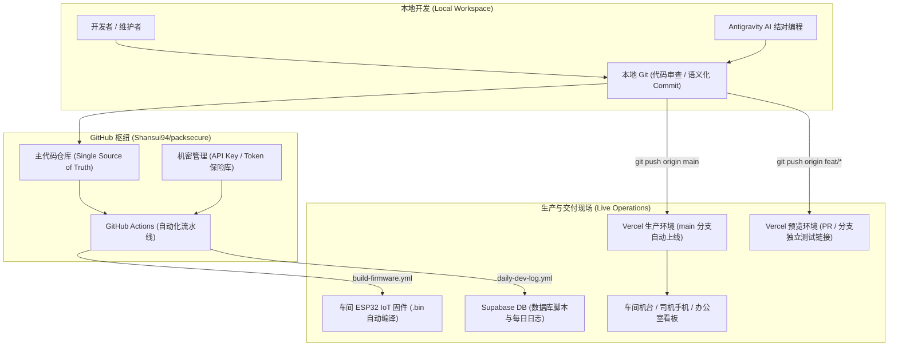

# Packsecure OS — GitHub 协作与高效实战指南

> 面向维护者与 AI 智能体（Antigravity）的工程实践手册。结合单人全栈、24 小时工厂现场运营与 Vercel 持续交付体系编写。

---

## 1. 什么是 GitHub？它与我们的关系是什么？

### 1.1 什么是 Markdown（.md）与 Git/GitHub？
* **Markdown（.md）**：是一种轻量、通用的纯文本排版格式（本文档即是 `.md`）。它易写易读，不需要打开笨重的 Word，任何设备、代码编辑器或 GitHub 网页都能秒开，且能完美记录版本对比（Diff）。
* **Git**：安装在你本地电脑上的“版本时光机”，记录每一次代码修改的快照。
* **GitHub**：建立在 Git 之上的全球云端平台，是 Packsecure 项目的**中枢调度塔**与**安全防线**。

### 1.2 GitHub 在 Packsecure 架构中的四大定位



1. **唯一代码真理源（Single Source of Truth）**：系统的核心代码、业务真理库（`docs/BUSINESS_RULES.md`）、机台固件代码全部以此为基准。
2. **生产交付触发器（CD Hub）**：与 Vercel 深度联动，推送到 `origin/main` 即自动触发生产环境构建。
3. **现场运营时光机（Disaster Recovery）**：一旦工厂现场因 Bug 异常受阻，可通过历史 Commit 在 10 秒内恢复生产。
4. **自动化边缘构建中枢（CI Automation）**：云端自动编译 ESP32 硬件固件，定时通过 Gemini AI 提取代码改动并生成运维开发日志。

---

## 2. 怎么善用 GitHub？（5 大高收益实战策略）

### 策略一：善用「分支与 Vercel 预览」，防范现场事故
* **业务痛点**：单人开发若图快直接改 `main` 上线，万一界面在手机端错位、扫码功能崩溃，现场司机立刻在 WhatsApp 群报障。
* **最佳做法**：
  1. 重大改造或新功能创建特性分支（如 `git checkout -b feat/driver-qr-v2`）。
  2. 推送到 GitHub 后创建 Pull Request（PR）。
  3. Vercel 会自动在该 PR 下生成一个专属的**预览网址（Preview URL）**。
  4. 拿手机打开预览网址实操扫码或填写表单，确认无误后再合并入 `main`。

### 策略二：规范化「原子提交（Conventional Commits）」
* **为什么重要**：
  * 项目已配置 [`.github/workflows/daily-dev-log.yml`](file:///c:/Users/User/.gemini/antigravity-ide/scratch/packsecure/.github/workflows/daily-dev-log.yml)，每晚通过 Gemini AI 自动将当天的 Commit 总结为生产运营日志。
  * 清晰的 Commit 能让 AI 准确理解系统演进，也让故障排查变得极快。
* **推荐提交格式**：
  * `feat(driver): 增加司机端一键重新获取 GPS 定位按钮`
  * `fix(production): 修复 OPM 机台高计数时卷数计算溢出 Bug`
  * `docs(rules): 更新外籍工人加班费率与星期日计算规则`
  * `chore(iot): 优化 ESP32 断网重连与心跳间隔`

### 策略三：生产突发故障「10 秒极速回滚 SOP」
* **场景**：上线新功能后，车间平板白屏或司机提交不了交单。
* **应急操作**：
  1. **方案 A（最快，手机/网页即可操作）**：
     * 登录 Vercel 控制台 -> 找到 `packsecure` 项目 -> 进入 **Deployments**。
     * 点击上一个正常运行的构建版本 -> 选择 **Instant Rollback（即时回滚）**。现场立刻恢复！
  2. **方案 B（通过 Git 撤销并同步）**：
     ```bash
     # 撤销最近一次有问题的提交
     git revert HEAD --no-edit
     git push origin main
     ```

### 策略四：善用「GitHub Issues」沉淀现场问题
* **业务痛点**：现场 WhatsApp / 微信群的 Bug 汇报零散，容易被刷屏遗漏，或者修完后过两周再次出现。
* **最佳做法**：
  * 把高频、复杂的现场问题直接在 GitHub 仓库提一个 **Issue**（例如：`#18 称重机台串口间歇性丢包`）。
  * 与 Antigravity AI 结对排查时，直接提示：“请帮我处理 Issue #18”，AI 能聚焦背景，修完提交 `fix: resolve #18` 即可实现现场问题闭环。

### 策略五：绝不泄露机密（Secrets 安全底线）
* **红线**：
  * 本地 `.env` 永远加入 `.gitignore`，严禁提交包含真实 `SUPABASE_SERVICE_ROLE_KEY` 或 `GOOGLE_API_KEY` 的文件。
  * 自动化脚本所需的 API 秘钥统一配置在 GitHub 仓库的 **Settings -> Secrets and variables -> Actions** 中。

---

## 3. 日常标准工作流速查清单（Checklist）

```markdown
[ ] 1. 本地开发与 AI 结对完成功能修改。
[ ] 2. 运行本地验证：
      - 前端与类型自检：`npm run build`
      - 代码规范检查：`npm run lint`
[ ] 3. 审查变动：使用 `git status` 与 `git diff` 确认没有多改无关文件或泄露敏感配置。
[ ] 4. 提交代码：`git commit -m "feat/fix: 简要中文描述"`。
[ ] 5. 发布验证：
      - 常规修复：推送到 `origin/main`，观察 Vercel 构建状态并在生产环境核验。
      - 复杂功能：推送到功能分支并通过 Vercel Preview 链接在移动端真机核验。
```

---

## 4. 常用 Git 应急命令速查

| 需求 | 命令 |
| :--- | :--- |
| 查看当前修改的文件列表 | `git status` |
| 查看具体修改了哪些行 | `git diff` |
| 暂存所有修改并提交 | `git add . && git commit -m "描述"` |
| 推送到远程生产主分支 | `git push origin main` |
| 新建并切换到测试分支 | `git checkout -b feat/my-feature` |
| 拉取远程最新代码以防冲突 | `git pull origin main` |
| 彻底放弃本地未保存的所有修改（慎用） | `git restore .` |
