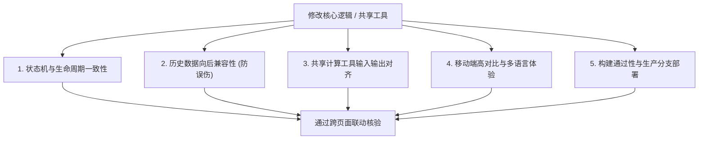

# Packsecure OS — 全页面联动升级与跨模块核查清单 (Page Sync Checklist)

> **版本**：v1.0 (2026-09-22)  
> **适用对象**：Antigravity Agent、全栈开发者、系统架构师  
> **核心宗旨**：Packsecure OS 各业务模块高度联动。**任何单点功能的修改或重构，都绝不能仅在单一页面测试后草率收尾**。每次更新必须对照本清单，审查上下游全部关联页面，杜绝“修了 A 页面导致 B 页面状态断裂、历史老单误唤醒、数据对账冲突或漏升级”。

---

## 目录

1. [五大核心核验维度标准 (5-Dimension Audit SOP)](#1-五大核心核验维度标准-5-dimension-audit-sop)
2. [变更触发索引：改动什么必查哪些页面 (Cross-Page Impact Map)](#2-变更触发索引改动什么必查哪些页面-cross-page-impact-map)
   - [域 1：送货单、多点拆分与配送行程 (`sales_orders`, `trips_v2`)](#触发域-1送货单多点拆分与配送行程)
   - [域 2：考勤、打卡、请假与排班 (`attendance_shifts`, `leaves`)](#触发域-2考勤打卡请假与排班)
   - [域 3：车间生产、交班扫码与机台看板 (`production_logs`, `machines`)](#触发域-3车间生产交班扫码与机台看板)
   - [域 4：仓储库存、原材料流转与物料扣减 (`inventory_matrix`, `stock_movements`)](#触发域-4仓储库存原材料流转与物料扣减)
   - [域 5：车队档案、里程打卡与维保申请 (`lorries`, `odometer_logs`)](#触发域-5车队档案里程打卡与维保申请)
3. [全系统 50 页面功能与依赖字典 (Full 50-Page Functional Dictionary)](#3-全系统-50-页面功能与依赖字典-full-50-page-functional-dictionary)
4. [AI Agent 强制自检工作流与标准报告模板](#4-ai-agent-强制自检工作流与标准报告模板)

---

## 1. 五大核心核验维度标准 (5-Dimension Audit SOP)

在修改任何逻辑（尤其是共享工具、状态机、字段类型或核心计算）后，对清单中列出的每一个关联页面，必须依次核查以下 5 个维度：



### 维度 1：状态机与单据生命周期一致性 (Status Machine Alignment)
- **标准**：全系统各页面对同一数据实体的状态理解必须严格对齐。
- **排查要点**：
  - 例如 `sales_orders` 的生命周期：`New` ➔ `Planned` ➔ `Loaded` ➔ `Delivered` / `Pending Approval` / `Cancelled`。
  - **装车阶段 (`Loaded`)**：属于运送中，多点订单在未送完所有 Drops 前，**状态必须严格保持为 `Loaded`**，严禁提前被改为 `Delivered`。
  - **送达阶段 (`Delivered`)**：一旦订单状态置为 `Delivered`，表示该单已经彻底结案。
  - **审批阶段 (`Pending Approval`)**：等待管理层审批，提成与报表需显示“待审核”角标，不可静默计入或漏记。

### 维度 2：历史数据向后兼容性与防误伤 (Historical Data Backward Compatibility)
- **标准**：新增加的校验规则、打卡要求或相片验证，**绝不可误伤数周/数月前已结案的历史单据**。
- **排查要点（典型血泪教训：Ameer 历史单据被唤醒案例）**：
  - 历史老单（如 3~6 月份单据）当年可能采用纸质 DO 签收，数据库中 `pod_photo_url` 为空或照片数少于设定点数。
  - **严禁**使用 `if (trip_drop_count > 1) return completedDrops >= trip_drop_count;` 这种盲目要求老单也有数字相片的逻辑，否则会导致几十趟甚至上百趟历史老单被当作“未完成”重新塞入司机的 Pending 待办列表！
  - **正确准则**：只要单据状态在数据库中已经是 `Delivered`，即认定为已送达。多点数量核验**仅适用于当前车上运送中的 `Loaded` 单据**。
  - 严格做好可选字段的 Null-Safety 降级防御（如 `order.items || []`, `notes || ''`, `trip_origin || 'TAIPING'`）。

### 维度 3：共享计算工具跨页面传参一致性 (Shared Utilities & Derived Logic)
- **标准**：公共工具函数一旦修改，必须全量检索所有调用页面，确认入参和返回值语义没有破坏性变更。
- **核心工具库清单**：
  - `src/utils/tripGrouping.ts`：行程聚合工具。注意分组 Key 必须带上日期前缀（`manual_${dateKey}_${tripTag}`），防止跨天同名 `trip 1` 被错误归并。
  - `src/services/stockService.ts`：库存扣减、冲回与增量调整（`deductStockForOrder`, `reverseStockForOrder`）。
  - `src/utils/pinAuth.ts` / `api/lib/pin-auth.ts`：司机与操作员快速 PIN 码鉴权。
  - `src/utils/imageCompress.ts`：拍照与相册压缩，确保上传格式与 Base64 解码一致。
  - `src/utils/driverBalanceDispatch.ts`：智能平衡派单算法。

### 维度 4：移动端大屏高对比与多语言 UI (Mobile UX & I18N)
- **标准**：司机端、车间操作员端主要在现场手机（375px~390px 视口）或车间壁挂平板使用，必须遵循工业级人机工程学。
- **排查要点**：
  - 按钮尺寸足够大（最小高度 44px~48px），触控间距防误触。
  - 高对比度配色：已完成为绿（`emerald`）、进行中为蓝/黄（`blue`/`amber`）、异常/故障为红（`red`）。
  - 弹窗（Modal）高度不能溢出屏幕导致遮挡底部确定或关闭按钮。
  - 严格遵循 [I18N_GUIDELINES.md](I18N_GUIDELINES.md)：司机与管理层需中英马三语对照，车间外籍工人需提供缅/印/孟加拉六语。严禁硬编码未翻译的英文黑话。

### 维度 5：部署分支与构建通过性 (Branch & Build Guardrails)
- **标准**：上线必须推送到生产主干，杜绝“代码写了但生产未生效”。
- **排查要点**：
  - 代码改动完成后，必须在本地终端执行 **`npm run build`** 预编译自检，确保 Vite 构建与 TS 类型 100% 通过（0 错误）。
  - **生产部署分支为 `origin/main`**。若仅推送到 `test` 分支，Vercel 生产环境不会更新！必须 merge 并 push 到 `origin/main`。

---

## 2. 变更触发索引：改动什么必查哪些页面 (Cross-Page Impact Map)

当你的任务涉及以下核心业务域的变更时，**必须把下方表格中对应的所有页面纳入排查范围**：

### 触发域 1：送货单、多点拆分与配送行程
> **涉及数据表**：`sales_orders`, `trips_v2`, `trip_stops_v2`, `driver_trip_rates`  
> **典型业务场景**：修改送货单状态、增加卸货点、拍照签收（POD）、手写单导入、行程分趟、司机运费/提成计算。

| 序号 | 关联页面文件 | 页面定位 | 变更时必查项 |
| :--- | :--- | :--- | :--- |
| 1.1 | `src/pages/DeliveryOrderManagement.tsx` | 调度台 / 送货单管理 | 订单状态显示、手动拆单/合单、分配司机与车辆、排单池过滤、自动扣减/冲回库存。 |
| 1.2 | `src/pages/OrderSummary.tsx` | 每日排单总览 | 行程卡片分组、Daily Prep 装车拍照/相册、每趟卷数/重量统计、自提交更弹窗。 |
| 1.3 | `src/pages/DriverDelivery.tsx` | 司机端实时配送 | `Dalam Proses` 与 `Selesai` 选项卡划分、多点签收计数 `(Drop X/Y)`、提前结案二次确认、绑车/解车交更。 |
| 1.4 | `src/pages/DriverHistory.tsx` | 司机配送历史 | 历史已完成订单查阅、POD 签收单与照片预览、防止遗漏历史单据。 |
| 1.5 | `src/pages/PersonalMonthlyReport.tsx` | 个人月度报表 | 司机 Trip 计数与提成金额核算、`groupOrdersIntoTrips` 行程归并（防跨天混淆）、待审核角标显示。 |
| 1.6 | `src/pages/StaffStatusSignOff.tsx` | 人员在岗与交更签核 | 仓管/调度对司机每日出车状态与结更签收核验、夜班跨天行程对账。 |
| 1.7 | `src/pages/LiveFleet.tsx` | 车队实时监控 | 车辆在途状态显示、与当前配送行程关联是否正常。 |
| 1.8 | `src/pages/TripPrep.tsx` | 出车前装货准备 | 出车前物料清点、备货拍照、装车状态流转。 |

---

### 触发域 2：考勤、打卡、请假与排班
> **涉及数据表**：`attendance_shifts`, `leaves`, `advances`, `overtimes`, `users_public`  
> **典型业务场景**：打卡记录、工时计算、司机派生考勤、请假申请/审批、借支申请、公假/周末加班补贴。

| 序号 | 关联页面文件 | 页面定位 | 变更时必查项 |
| :--- | :--- | :--- | :--- |
| 2.1 | `src/pages/HRPortal.tsx` | 人力资源综合门户 | 员工列表、薪资明细、考勤汇总、请假审批列表、借支审批与银行转账标记。 |
| 2.2 | `src/pages/LeaveCalendar.tsx` | 请假与排休日历 | 假期日历可视化、司机请假期间自动阻断派单逻辑、撤销请假恢复派单。 |
| 2.3 | `src/pages/StaffStatusSignOff.tsx` | 每日人员签到签退 | 车间工人/司机上下班打卡补录、夜班跨天工时折算、每日考勤闭环。 |
| 2.4 | `src/pages/PersonalMonthlyReport.tsx` | 个人月度报表 | 每日出勤工时、加班时数、派生考勤（从里程表/出车记录推导）、公假与周日出勤标记。 |
| 2.5 | `src/pages/MachineSchedule.tsx` | 机台生产排班 | 操作员请假/缺勤时在机台排班中的冲突预警。 |

---

### 触发域 3：车间生产、交班扫码与机台看板
> **涉及数据表**：`production_logs`, `job_orders`, `machines`, `recipes`, `factory_downtime_logs`  
> **典型业务场景**：机台开工/交班、条码扫码上料、米数/卷数实时计数、良品率计算、停机报警与机修报障。

| 序号 | 关联页面文件 | 页面定位 | 变更时必查项 |
| :--- | :--- | :--- | :--- |
| 3.1 | `src/pages/ProductionControl.tsx` | 车间机台主控台 | 选机台模式、IoT 脉冲实时计数、手动补卷、停机报警弹出、交班总结。 |
| 3.2 | `src/pages/YieldControl.tsx` | 良品率与配方中心 | 原材料配方换算、理论产出 vs 实际产出偏差、损耗率告警。 |
| 3.3 | `src/pages/FloorPlan.tsx` | 车间数字孪生平面图 | 机台红黄绿实时工作状态感知、平面图机台编号与报警同步。 |
| 3.4 | `src/pages/MachineSchedule.tsx` | 机台生产排程 | 生产工单指派、机台计划开工日期、产品规格排期。 |
| 3.5 | `src/pages/ProductionReports.tsx` | 生产统计报表 | 班次产量报表、停机分类统计、操作员产量排行。 |
| 3.6 | `src/pages/ExecutiveReports.tsx` | 高层运营大屏 | 全厂稼动率 (OEE)、各分厂日/月产量趋势对比。 |
| 3.7 | `src/pages/PersonalMonthlyReport.tsx` | 个人月度报表 | 操作员个人生产计件与计提总计、报工明细。 |
| 3.8 | `src/pages/FactoryLiveOS.tsx` | 全厂实时大屏 | 办公室 TV 轮播看板、各车间实时动态与告警聚合。 |

---

### 触发域 4：仓储库存、原材料流转与物料扣减
> **涉及数据表**：`inventory_matrix`, `stock_movements`, `v2_items`, `stock_audits`  
> **典型业务场景**：生产完工入库、发货扣减、跨厂区调拨、盘点对账、混料配比上料拍照。

| 序号 | 关联页面文件 | 页面定位 | 变更时必查项 |
| :--- | :--- | :--- | :--- |
| 4.1 | `src/pages/LiveStock.tsx` | 实时动态库存 | 多仓区 (OPM Lama, Corner, Ali, SPD, Nilai 等) 库存矩阵、负库存拦截与预警。 |
| 4.2 | `src/pages/Inventory.tsx` | 库存总览与对账 | 库存平衡对账、手动盘盈盘亏调整、出入库日志流。 |
| 4.3 | `src/pages/StockMovement.tsx` | 物料调拨流转 | 厂区之间移库记录、原材料领料与退料。 |
| 4.4 | `src/pages/StockAudit.tsx` | 仓储盘点审计 | 实物盘点盲盘/明盘录入、盘点差异审核。 |
| 4.5 | `src/pages/ProductLibrary.tsx` | 产品档案库 | SKU 规则、米数/重量/颜色规格定义、包装单位。 |
| 4.6 | `src/pages/DeliveryOrderManagement.tsx` | 送货单发货扣库 | 确认发货时触发 `deductStockForOrder`、取消或改单触发 `reverseStockForOrder`。 |
| 4.7 | `src/pages/RawMaterialMobilePortal.tsx` | 移动端混料与上料 | 原材料批次扫描、混料料斗拍照留痕、上料凭证上传。 |

---

### 触发域 5：车队档案、里程打卡与维保申请
> **涉及数据表**：`lorries`, `lorry_service_logs`, `odometer_logs`, `odometer_alerts`  
> **典型业务场景**：新增/注销货车、司机绑车、早晚里程表拍照打卡、里程跳变告警、车辆保养维修申报。

| 序号 | 关联页面文件 | 页面定位 | 变更时必查项 |
| :--- | :--- | :--- | :--- |
| 5.1 | `src/pages/LorryManagement.tsx` | 车辆资产管理 | 车牌号、容量容积 (m³)、载重上限、所属分厂、保养到期提醒、月度里程汇总。 |
| 5.2 | `src/pages/LorryService.tsx` | 车辆日常保养报备 | 司机保养申报单、机油/轮胎更换留痕、服务商发票上传。 |
| 5.3 | `src/pages/MaintenanceManagement.tsx` | 维修管理工单 | 故障报修单流转、维修费用审批、完工验收归档。 |
| 5.4 | `src/pages/DriverDelivery.tsx` | 司机端里程打卡 | 出车扫码绑定货车、拍摄起始里程表、收工拍摄结束里程表并解绑货车。 |
| 5.5 | `src/pages/PersonalMonthlyReport.tsx` | 个人月度报表 | 跨午夜里程表配对（防次日误判早班）、油耗与里程异常告警展示。 |

---

## 3. 全系统 50 页面功能与依赖字典 (Full 50-Page Functional Dictionary)

以下为 Packsecure OS 全部 50 个页面的功能、数据消费与上下游依赖全景字典，便于在更新时快速检索任意页面的架构特性：

### 模块 A：物流配送与调度链 (8 页面)
1. **`DeliveryOrderManagement.tsx` (送货单调度台)**
   - **角色**：调度员、物流协调员、管理员
   - **核心表**：`sales_orders`, `trips_v2`, `trip_stops_v2`, `lorries`, `v2_items`
   - **共享工具**：`autoRouting.ts`, `driverBalanceDispatch.ts`, `stockService.ts`
   - **重点约束**：支持 PDF 智能解析建单；发货时必须同步调用库存服务；支持单 DO 多点拆分。
2. **`OrderSummary.tsx` (每日排单汇总)**
   - **角色**：物流主管、仓管、出纳
   - **核心表**：`sales_orders`, `trips_v2`, `lorries`
   - **共享工具**：`tripGrouping.ts`, `imageCompress.ts`
   - **重点约束**：支持按厂区分组打印装车清单；支持 Daily Prep 照片拍摄与相册双轨上传。
3. **`DriverDelivery.tsx` (司机移动配送端)**
   - **角色**：司机 (`Driver`)
   - **核心表**：`sales_orders`, `lorries`, `odometer_logs`, `trips_v2`
   - **共享工具**：`countCompletedDrops`, `isOrderFullyDelivered`, `imageCompress.ts`
   - **重点约束**：375px~390px 移动端专用；`Dalam Proses` vs `Selesai`；多点送货需严格校验已完成点数。
4. **`DriverHistory.tsx` (司机配送历史)**
   - **角色**：司机 (`Driver`)
   - **核心表**：`sales_orders`
   - **重点约束**：仅显示已送达 (`Delivered`) 的订单与签收 POD。
5. **`TripPrep.tsx` (出车准备看板)**
   - **角色**：仓管、司机
   - **核心表**：`sales_orders`, `trips_v2`
   - **重点约束**：装车前复核件数与物料位置。
6. **`LiveFleet.tsx` (车队实时看板)**
   - **角色**：调度员、管理层
   - **核心表**：`lorries`, `sales_orders`, `driver_gps_logs`
   - **重点约束**：地图实时展示在途车辆位置与当日完成进度。
7. **`LorryManagement.tsx` (车辆管理)**
   - **角色**：车队经理、管理员
   - **核心表**：`lorries`, `odometer_logs`, `lorry_service_logs`
   - **重点约束**：维护车队物理容量、载重、默认分厂与每月 Odoo 对账。
8. **`LorryService.tsx` (车辆维保申报)**
   - **角色**：司机、车队长
   - **核心表**：`lorry_service_logs`, `lorries`
   - **重点约束**：支持维保收据拍照上传与历史维保档案。

---

### 模块 B：车间生产与机台管控链 (11 页面)
9. **`ProductionControl.tsx` (机台主控台)**
   - **角色**：机台操作员 (`Operator`)、车间主管
   - **核心表**：`production_logs`, `machines`, `job_orders`, `attendance_shifts`
   - **重点约束**：支持 IoT 自动上报与工人手动扫码报工；六语无障碍切换；支持离线短时缓存。
10. **`YieldControl.tsx` (良品率与配方中心)**
    - **角色**：生产厂长、工艺工程师
    - **核心表**：`recipes`, `production_logs`, `v2_items`
    - **重点约束**：米数、重量与理论配方比对。
11. **`MachineSchedule.tsx` (生产排程日历)**
    - **角色**：生产调度、车间主任
    - **核心表**：`job_orders`, `machines`, `attendance_shifts`
    - **重点约束**：按机台甘特图排期；自动规避操作员请假。
12. **`FloorPlan.tsx` (车间数字孪生)**
    - **角色**：厂长、管理层
    - **核心表**：`machines`, `production_logs`
    - **重点约束**：俯视平面图展示 1~4 车间机台开停机状态。
13. **`ProductionLog.tsx` (生产明细日志)**
    - **角色**：统计员、质检员
    - **核心表**：`production_logs`
    - **重点约束**：全量按时间序查阅每一卷产出明细与废料原因。
14. **`ProductionReports.tsx` (生产统计报表)**
    - **角色**：管理层、生产部
    - **核心表**：`production_logs`, `job_orders`
    - **重点约束**：日产量、班次产量、废品率折线图与导出 Excel。
15. **`ExecutiveReports.tsx` (管理层高阶大屏)**
    - **角色**：老板、高管
    - **核心表**：全厂核心指标聚合
    - **重点约束**：全局产值、运能负荷与综合效率 KPI。
16. **`FactoryLiveOS.tsx` (车间大屏看板)**
    - **角色**：车间 TV 投屏
    - **核心表**：`machines`, `production_logs`
    - **重点约束**：深色大屏全屏模式，无交互自动刷新。
17. **`MachineLabels.tsx` (机台标牌与二维码)**
    - **角色**：IT、厂务
    - **核心表**：`machines`
    - **重点约束**：批量生成打印机台设备固定二维码。
18. **`MaintenanceManagement.tsx` (设备维修管理)**
    - **角色**：机修工、生产主管
    - **核心表**：`maintenance_tickets`, `machines`
    - **重点约束**：停机报修、工单抢单、配件消耗与修复计时。
19. **`AuditReport.tsx` (审计与质检报告)**
    - **角色**：审计员、品控主管
    - **核心表**：`stock_audits`, `production_logs`
    - **重点约束**：核查物料消耗与异常产出。

---

### 模块 C：人力资源、考勤与薪资链 (6 页面)
20. **`HRPortal.tsx` (人力资源综合门户)**
    - **角色**：HR 经理、管理层
    - **核心表**：`users_public`, `attendance_shifts`, `leaves`, `advances`, `payrolls`
    - **重点约束**：员工档案、权限分配、借支审核、底薪与津贴配置。
21. **`LeaveCalendar.tsx` (请假排休日历)**
    - **角色**：全员申请、主管审批
    - **核心表**：`leaves`, `users_public`, `malaysia_holidays`
    - **重点约束**：马来西亚各州公共假期核验；司机请假自动锁定排单。
22. **`StaffStatusSignOff.tsx` (每日人员在岗签核)**
    - **角色**：部门主管、出纳
    - **核心表**：`attendance_shifts`, `users_public`
    - **重点约束**：每日考勤关账、夜班跨天核对、替班与异常打卡签核。
23. **`PersonalMonthlyReport.tsx` (员工/司机月度报表)**
    - **角色**：司机、操作员、管理层
    - **核心表**：`sales_orders`, `attendance_shifts`, `production_logs`, `lorries`
    - **共享工具**：`tripGrouping.ts`, `malaysiaHolidays.ts`
    - **重点约束**：个人对账真理源泉；司机出车提成、跨日 Trip 归并、里程表照片核验、公假出勤标记。
24. **`Profile.tsx` (个人中心)**
    - **角色**：当前登录用户
    - **核心表**：`users_public`
    - **重点约束**：个人资料、头像修改、语言偏好设置。
25. **`UpdatePassword.tsx` (密码修改)**
    - **角色**：当前登录用户
    - **重点约束**：Supabase Auth 密码强规则重置。

---

### 模块 D：仓储、物料与供应链链 (7 页面)
26. **`LiveStock.tsx` (多仓实时库存)**
    - **角色**：仓管主管、销售员
    - **核心表**：`inventory_matrix`, `v2_items`
    - **重点约束**：分厂库存分布，支持搜索规格、气泡卷型号、颜色。
27. **`Inventory.tsx` (仓储综合管理)**
    - **角色**：总仓管、财务
    - **核心表**：`inventory_matrix`, `stock_movements`
    - **重点约束**：库存流水、批量平账与进销存报表。
28. **`StockMovement.tsx` (调拨流水记录)**
    - **角色**：仓管员
    - **核心表**：`stock_movements`
    - **重点约束**：出入库批次追踪、车间领料登记。
29. **`StockAudit.tsx` (实物盘点)**
    - **角色**：盘点员、财务
    - **核心表**：`stock_audits`
    - **重点约束**：定期盘点录入，盘盈盘亏自动计算。
30. **`ProductLibrary.tsx` (产品与物料中心)**
    - **角色**：产品工程师、销售
    - **核心表**：`v2_items`
    - **重点约束**：SKU 规则、气泡膜单双层、颜色分类、米数换算。
31. **`RawMaterialMobilePortal.tsx` (原料上料移动端)**
    - **角色**：车间混料工
    - **核心表**：`raw_material_logs`
    - **重点约束**：移动端后置相机拍摄料斗与原料袋条码。
32. **`Customer360Console.tsx` (客户画像与订单跟踪)**
    - **角色**：客服、销售经理
    - **核心表**：`sales_orders`, `customers`
    - **重点约束**：单个客户历史送货频次、偏好与欠款统计。

---

### 模块 E：系统管理、AI与协同工具 (18 页面)
33. **`Login.tsx` (用户登录)**：Supabase 账号密码与 PIN 快速登录。
34. **`Register.tsx` (员工注册)**：新员工入职注册与资料收集。
35. **`BossCoPilot.tsx` (AI 运营智囊)**：基于 Gemini 的全系统业务问答与经营洞察。
36. **`WilliamDocumentCenter.tsx` (威廉公文中心)**：工厂重要制度、合同与官方文件归档。
37. **`SystemDocsEditor.tsx` (系统文档编辑器)**：在线编辑 SOP 与系统技术说明。
38. **`SOPCenter.tsx` (标准化作业程序中心)**：车间生产、物流配送各岗位 SOP 视频与图文教程。
39. **`WorkPhotoLog.tsx` (工作照片流)**：全厂所有业务照片（打卡、装车、卸货、保养、混料）统一聚合审计流。
40. **`ActivityLogs.tsx` (系统操作审计日志)**：全系统用户增删改操作审计跟踪。
41. **`DevLog.tsx` (开发与版本日志)**：版本发版记录、功能变更备忘。
42. **`DataManagement.tsx` (元数据管理)**：系统字典、数据表备份与底层配置。
43. **`SalesOrders.tsx` (销售单查看)**：业务销售订单台账。
44. **`Tasks.tsx` (日常任务协同)**：管理层交办日常事项待办板。
45. **`Notes.tsx` (便签记事本)**：个人与部门共享备忘便签。
46. **`TeamChat.tsx` (站内即时通讯)**：车间与办公室部门群聊与单聊。
47. **`ReportHistory.tsx` (历史报表归档)**：月结报表 PDF/Excel 历史快照库。
48. **`IoTManagement.tsx` (IoT 设备管理)**：工业采集网关、传感器状态与信号监控。
49. **`UnderConstruction.tsx` (施工中占位页)**：未开放功能占位提示。
50. **`ClaimsManagement.tsx` (报销与津贴审批)**：司机油费、路桥费、垫付费审批管理。

---

## 4. AI Agent 强制自检工作流与标准报告模板

### 执行规程 (Mandatory Execution Rule)
1. **触发识别**：Agent 在接到任务后，首先识别该任务命中了哪几个【变更触发域】（如涉及订单、考勤、生产或库存）。
2. **清单检索**：根据本清单提取全部必须检视的关联页面。
3. **逐页联动升级与防御自检**：
   - 检查状态枚举是否兼容。
   - 检查历史老数据是否会被新逻辑误判（如 Ameer 老单误唤醒）。
   - 检查共享工具参数是否一致。
   - 确保 `npm run build` 本地通过。
   - 确认推送至 `origin/main` 生产分支。
4. **输出结论**：在最终向用户交付时，**必须在回复末尾附带以下格式的标准自检表格**：

### 标准交付汇报表格模板
```markdown
### 📋 跨页面联动升级核验报告 (Cross-Page Sync Audit)

- **本次变更核心域**：[如：送货单多点卸货 / 考勤工时折算 / 库存发货扣减]
- **受影响共享工具**：[如：`tripGrouping.ts` / `stockService.ts` / 无]

| 关联页面 | 核心检验项 | 是否受影响/需升级 | 核验结果 |
| :--- | :--- | :---: | :--- |
| `DriverDelivery.tsx` | 多点单状态保持在 Loaded，仅全部送完或确认提早结束才变 Delivered | 是 (已升级) | ✅ 验证通过，当前单据保持 Pending |
| `PersonalMonthlyReport.tsx` | 月度行程归并 Key 增加日期前缀，防跨天同名 Trip 混淆 | 是 (已升级) | ✅ 验证通过，DO与Trip精准分离 |
| `DeliveryOrderManagement.tsx`| 调度台状态展示与库存扣减一致性 | 否 (仅核验) | ✅ 状态与排单池显示正常 |
| 历史数据兼容性 | Ameer / Yan 等全员历史已结案老单防误判 | 是 (已加固) | ✅ 历史 198 趟老单稳定归入 Selesai |

- **预编译自检**：`npm run build` 通过（0 errors）
- **部署分支核实**：已合并并推送到 `origin/main`（生产环境生效）
```
