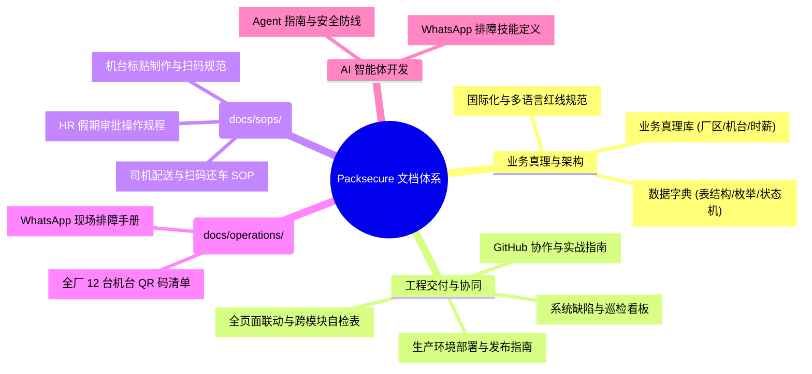

# Packsecure OS — 文档知识库与全景索引中心 (Documentation Hub)

> 本文档是 Packsecure OS 的全局文档导航中枢。汇总了系统所有的业务规则、技术规范、现场 SOP、工程实践与 AI 协同指南。

---

## 📚 文档矩阵分类概览



---

## 一、 核心业务真理与数据架构 (Business Truth & Architecture)

系统业务逻辑与底层数据的绝对真理来源。任何新功能、费率变动或数据结构修改必须遵照并同步更新这些文档。

| 文档名称 | 对应路径 | 核心作用与内容 | 适用对象 |
| :--- | :--- | :--- | :--- |
| **业务真理库** | [`docs/BUSINESS_RULES.md`](BUSINESS_RULES.md) | **系统最高业务规则**：各厂区代号（T1/N1/K1/J1）、机台时薪、夜班时段（12AM-8AM）拆分、加班费率、车辆装载容量与额外补贴标准。 | 全体开发者、AI Agent、业务主管 |
| **数据结构字典** | [`docs/DATA_DICTIONARY.md`](DATA_DICTIONARY.md) | Supabase 数据库核心表结构、外键依赖、状态机枚举值（如 `JobOrderStatus`、`DeliveryStatus`）及字段业务含义。 | 全栈开发、DBA、AI Agent |
| **国际化多语言规范** | [`docs/I18N_GUIDELINES.md`](I18N_GUIDELINES.md) | 管理层与司机三语体系（中/英/马）、外籍工人六语（孟加拉/缅甸/尼泊尔等）、车间大图标红绿黄高对比度设计标准及防语言混杂红线。 | 前端工程师、UI/UX 设计 |

---

## 二、 工程实践、发布与交付流水线 (Engineering & DevOps)

保障系统稳定、安全、可控交付的工程准则与应急工具。

| 文档名称 | 对应路径 | 核心作用与内容 | 适用对象 |
| :--- | :--- | :--- | :--- |
| **GitHub 协作指南** | [`docs/GITHUB_WORKFLOW_GUIDE.md`](GITHUB_WORKFLOW_GUIDE.md) | GitHub 与 Vercel 联动机制、分支防爆策略、原子化 Commit 规范、生产故障 10 秒回滚 SOP 与 Git 常用命令。 | 开发者、AI Agent |
| **生产部署指南** | [`docs/DEPLOYMENT_GUIDE.md`](DEPLOYMENT_GUIDE.md) | 本地与线上发布步骤、`npm run build` 预检、PowerShell 一键发布脚本与 Vercel CLI 手动发布 SOP。 | 运维人员、发布负责人 |
| **跨页面联动核查清单** | [`docs/PAGE_SYNC_CHECKLIST.md`](PAGE_SYNC_CHECKLIST.md) | 修改公共逻辑或数据源时的跨模块影响评估（如考勤改动涉及 StaffStatus、PersonalMonthlyReport、Payroll 等 50 个页面的联动规则）。 | 全栈开发、AI Agent |
| **缺陷与巡检看板** | [`docs/SYSTEM_ISSUES.md`](SYSTEM_ISSUES.md) | QA 自动化巡检与 Bug 修复的双窗口协同看板，追踪严重缺陷（P1/P2）的复现路径、根因及修复状态。 | 质量保证 (QA)、开发者 |

---

## 三、 车间现场 SOP 与操作手册 (Factory SOPs & Operations)

直接面向工厂、仓库、车队与 HR 的标准化作业指导书，支持直接打印或在前端「SOP 中心」查阅。

| 文档名称 | 对应路径 | 核心作用与内容 | 适用对象 |
| :--- | :--- | :--- | :--- |
| **司机配送 SOP** | [`docs/sops/SOP_Driver_Delivery.md`](sops/SOP_Driver_Delivery.md) | 司机手机端登录、扫车码绑定、沿途客户签收（POD 照片与 DO 上传）、回厂扫办公室 QR 结束行程双语作业标准。 | 物流主管、车队司机 |
| **HR 请假审批 SOP** | [`docs/sops/SOP_HR_Leave_Approval.md`](sops/SOP_HR_Leave_Approval.md) | HR 与管理人员后台审核待办假期、排班冲突校验、一键批准/拒绝及撤销审批的操作手册。 | HR 人事、部门主管 |
| **机台标贴制作 SOP** | [`docs/sops/SOP_Machine_Labeling.md`](sops/SOP_Machine_Labeling.md) | 车间机台标签二维码制作参数、防水防油过塑要求、张贴位置及手机远距离（1.5米）扫码规范。 | 车间主管、电工、设备维护员 |
| **机台 QR 码清单** | [`docs/operations/QR_CODES_LIST.md`](operations/QR_CODES_LIST.md) | 太平、汝来、吉兰丹、柔佛 4 大厂区 12 台核心生产设备（Extruder/Recycle）的标准 Machine ID 与扫码内容清单。 | 车间操作工、设备管理员 |
| **WhatsApp 排障手册** | [`docs/WHATSAPP_ISSUE_TRIAGE.md`](WHATSAPP_ISSUE_TRIAGE.md) | 马来语/Manglish 俚语缩写字典、司机与操作员高频报障矩阵、技术排查 SQL 与对用户友好（无技术黑话）的回发草稿规范。 | 现场客服、运维、AI Agent |

---

## 四、 AI 智能体开发与协作规范 (AI Agent Guidelines)

指导 AI 编程助手（Antigravity Agent）安全参与项目开发的上下文与规则文件。

| 文档名称 | 对应路径 | 核心作用与内容 | 适用对象 |
| :--- | :--- | :--- | :--- |
| **Agent 指南** | [`AGENTS.md`](../AGENTS.md) | 系统技术栈、核心路由与 API 入口、代码风格、关键安全防线（Safety Guardrails）以及禁止硬编码规则。 | Antigravity AI Agent |
| **排障技能定义** | [`.agents/skills/whatsapp-issue-triage/SKILL.md`](../.agents/skills/whatsapp-issue-triage/SKILL.md) | 将现场群聊报障转化为技术诊断与业务 SOP 核验的专用 Skill 配置。 | Antigravity AI Agent |

---

## 💡 文档维护与更新指引 (Maintenance Rules)

1. **业务规则变动**：优先修改 [`docs/BUSINESS_RULES.md`](BUSINESS_RULES.md)，随后使用 [`docs/PAGE_SYNC_CHECKLIST.md`](PAGE_SYNC_CHECKLIST.md) 检索受影响的业务页面。
2. **新增 SOP 文章与一键同步**：
   * 在 `docs/sops/` 下新建或编辑 `.md` 文件，头部添加规范的 YAML Frontmatter（title, page_id, description, applicable_roles 等）。
   * 运行快捷命令自动全量入库至 Supabase `sop_articles` 表：
     ```bash
     npm run sync:sops
     ```
   * 前端「SOP 中心」将立刻同步更新，实现 Docs-as-Data 零维护成本。
3. **保持纯文本格式**：严禁混入私有二进制格式，统一采用 UTF-8 编码的 GitHub 兼容 Markdown。
